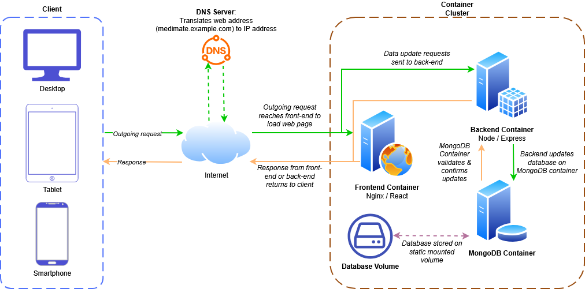
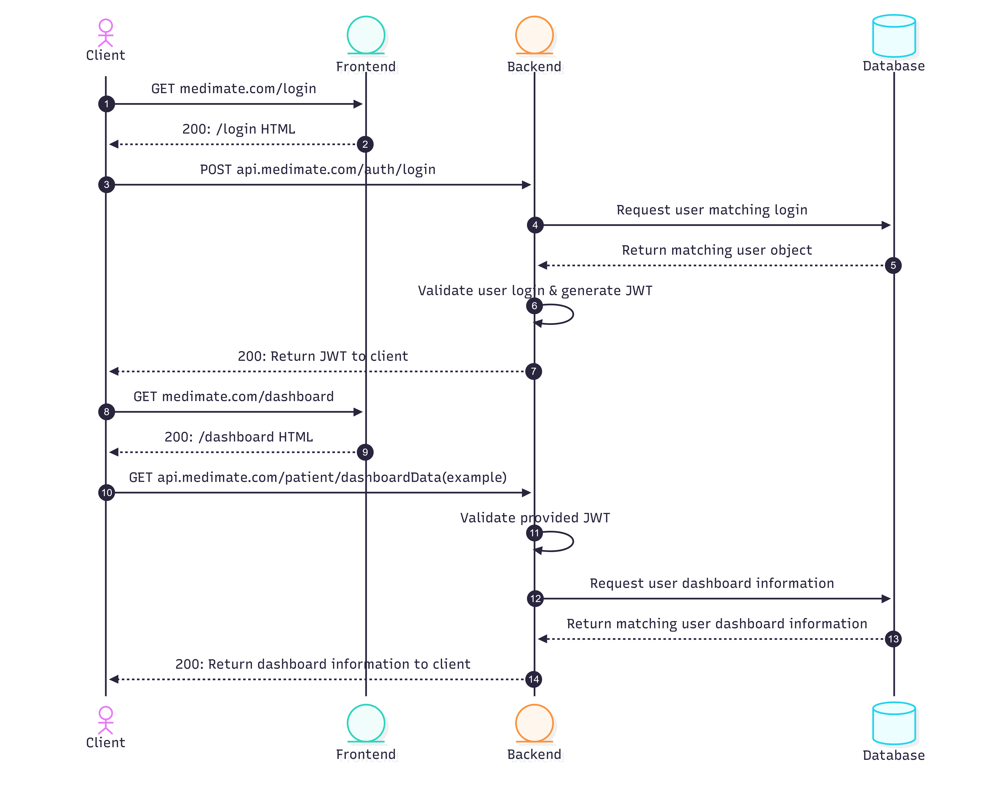

# Medimate-Deployed Application Architecture Diagrams
This document provides architecture diagrams for the Medimate-Deployed application, illustrating the components and their interactions within the system.

## 1. Overall System Architecture

The overall system architecture diagram depicts a high-level overview of the Medimate application, showcasing the main components of the container cluster, and how they interact with each other and the client.
1. **Client**: Represents the end user interacting with Medimate through a web interface on desktop, or web application on mobile or tablet devices.
2. **Internet**: All communication between the client and Medimate services occur over the internet, ensuring accessibility from various locations and devices.
3. **DNS**: The Domain Name System (DNS) translates the human readable domain name (e.g. medimate.example.com) into the IP address of the Medimate services, allowing client requests to reach the application.
4. **Container Cluster**: The core of the Medimate application, consisting of a series of connected containers that host the components of the application.
    - **Frontend Container**: Web server hosting the user interface of the Medimate application. Initial requests from the client reach this container, which responds by serving HTML, CSS & JavaScript files to the client.
    - **Backend Container**: API server that processes requests from the client, responsible for handling business logic of the application and communicating with the database container as necessary.
    - **Database Container**: Stores all persistent data for the Medimate application, including user information, booking information, and other relevant data. Only accessed by the backend container to ensure data security.
    - **Database Volume**: A persistent storage volume attached to the database container, ensuring retention of data through container restarts and updates.

## 2. Login Sequence Diagram

The login sequence diagram details the interactions between the client and Medimate application containers during the login process.
1. The client initiates a GET request to the frontend container to access the login page.
2. The frontend container responds by serving the login page (HTML, CSS, JavaScript) to the client.
3. The client enters their login credentials and submits the login form, sending a POST request to the backend container including their credentials (username and password).
4. The backend container begins processing the login request by requesting user information from the database container, matching the provided credentials from the client.
5. The database container returns a matching user record to the backend container.
6. The backend container validates the saved user information from the database against the credentials provided by the client. If the credentials are valid, the backend container generates a JSON Web Token (JWT) for the client.
7. The backend container responds to the client with a success status and the generated JWT.
8. The client stores the JWT, and creates a new GET request to the frontend container to access the /dashboard page.
9. The frontend container responds by serving the dashboard page to the client.
10. The client makes a GET request to the backend container to retrieve user-specific data for the dashboard, including the JWT in the request.
11. The backend container validates the JWT to ensure the client is authenticated and authorized to access the requested data.
12. The backend container requests the dashboard data from the database container.
13. The database container returns the requested dashboard data to the backend container.
14. The backend container responds to the client with the requested data, which is rendered on the dashboard for the client to view.